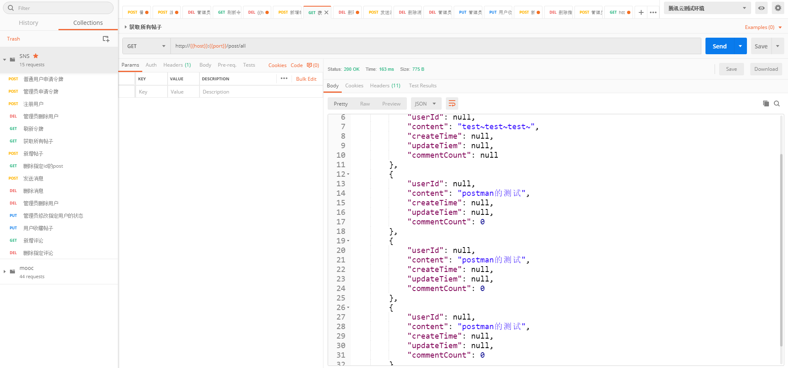
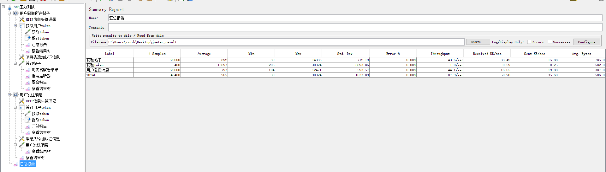

# sns-dubbo
## 介绍

​		这个项目是JEE课程作业的 dubbo版本，实现的功能非常简单。主要使用到SpringBoot，JWT，Spring Security，spring data JPA，Dubbo，Docker，Redis，MySQL，Zookeeper。

使用Spring Security + JWT来实现权限认证，使用Spring Data JPA 做持久层操作，使用redis做数据缓存，使用Dubbo和Zookeeper实现分布式架构，使用Docker实现应用快速部署，使用Jmeter做应用的压力测试。

## 使用

​		应用以Docker容器的方式进行部署：

1. 启动MySQL、Redis、Zookeeper容器

   ```shell
   docker-compose -f app.yml up 
   ```

2. 启动sns_service容器

   ```shell
   docker-compose -f sns_consumer.yml up
   ```

3. 启动sns-consumer容器

   ```shell
   docker-compose -f sns-consumer.yml up
   ```


## 应用截图

postman截图



jmeter压力测试截图：

